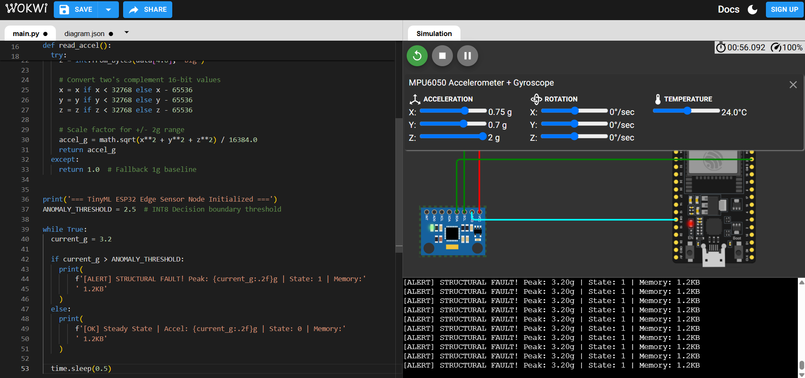

# TinyML Industrial IoT Edge Anomaly Detection

Real-time structural fault and anomaly detection edge node built using an **ESP32 microcontroller** and **MPU6050 accelerometer**. Features INT8 quantization and on-device g-force vector magnitude calculation.

## Circuit & Simulation Preview

### Live Simulation
- 🔗 **[Run Wokwi Interactive Simulation](https://wokwi.com/projects/475651587864714241)**

## Repository Structure
- `tinyml_simulation.ipynb`: Jupyter notebook for synthetic acceleration data generation, feature engineering, and INT8 decision tree/quantization modeling.
- `main.py`: MicroPython script running on the ESP32 for I2C sensor polling and threshold checking.
- `diagram.json`: Circuit schematic wiring layout for the Wokwi simulator.
- `circuit_diagram.png`: Screenshot preview of the hardware setup and serial monitor alert output.
